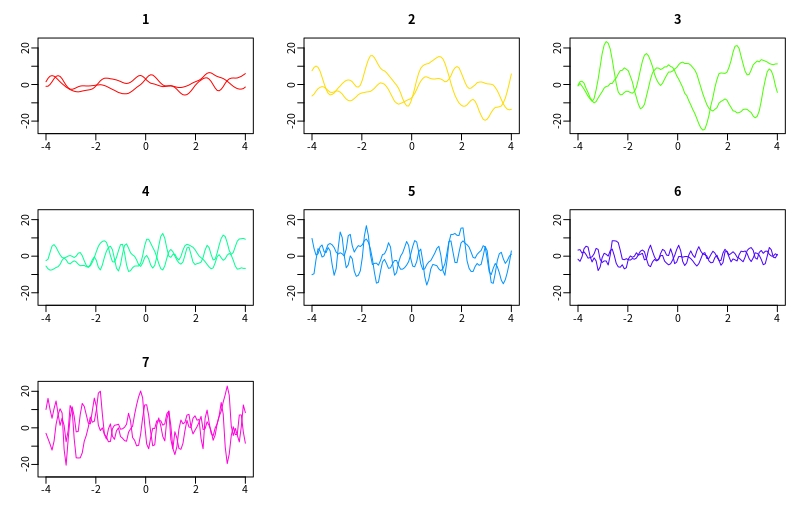

# Large K
matlab聚类结果

- 种子
113584957
487306701
812614905
- 19类，每一类2条曲线，类别如下
- 1 th 10 10 0.001
- 2 th 10 50 0.01
- 3 th 10 90 0.1
- 4 th 30 50 0.05
- 5 th 50 50 0.001
- 6 th 90 10 0.1
- 7 th 90 90 0.001

- 预测20000步，结果如下
 2 2 5 5 6 6 4 4 3 3 1 1 3 3
