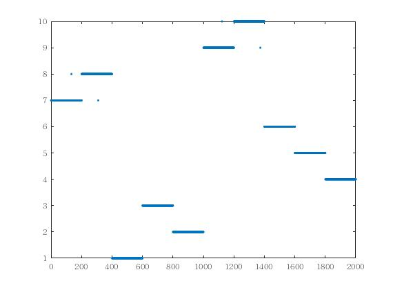
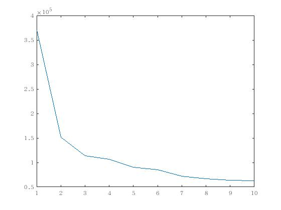
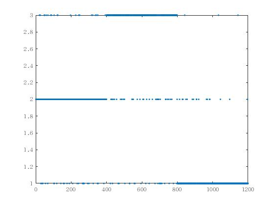
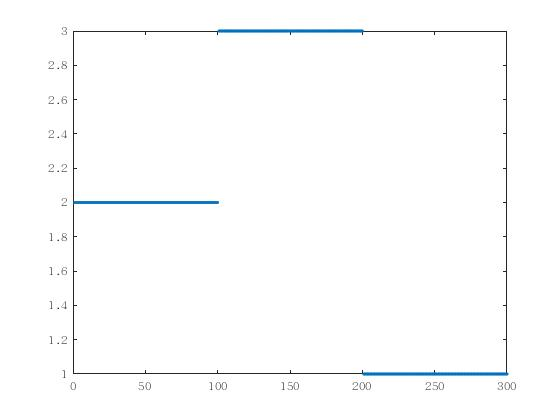

Large K

 零均值的模拟数据，零均值的模型

##  split-EM算法  SMGPFL.m
- 时间 107min
- 每一类200条曲线
为了参数估计的精度，取每一类200条曲线
- 参数学习结果

| 类别 | $\sqrt{v}$ | $\sqrt{w}$ | $\sqrt{\sigma^2}$ |
| ---- | ---------- | ---------- | ----------------- |
0.4537    1.0016   -0.0501
  1.0021    0.6999    0.0320
  0.4552    3.1490    0.0226
  0.6491    0.2923    0.0627
  0.1989    0.7051    0.0222
  3.3724    5.8786   -0.3151
  5.7606    5.4420    0.6493
  1.5658    6.7026    1.2682
  4.0346    3.3330    0.4426
  3.1509    3.1684    0.0313

真实的参数

| 第几类 | $\sqrt{v}$ | $\sqrt{w}$ | $\sqrt{\sigma^2}$ |
| ------ | ---------- | ---------- | ----------------- |
0.4472    1.0000    0.0500
 1.0000      0.7071     0.0316  
 0.4472      3.1623    0.0224  
0.6325 0.3 0.0632
0.2 0.7071 0.0220
3.3166   5.8644     0.3162
5.6833   5.4772     0.6633                                   
1.5555   6.8644    1.2649             
 4.1231    3.3166      0.4472            
 3.1623     3.1623      0.0316  

-  分类结果

  

  误分类率　 0.0020

结果可以看到，第1类，第4类和第5类区分不开
第6类和第7类相互重叠度较高。
试图只取第1,4,5类进行曲线聚类

- BIC

两种终止算法
  1. 每一次分裂重复100次，如果接受概率均小于1e-5,则终止
  2. BIC开始变大，则终止

然而，当重复次数足够多接受概率都非常小时，说明继续分裂的可能性已经非常小了，因而也不太可能计算出这之后分裂出的新参数的BIC。实际上，实验结果验证了这一点，BIC一直在减小，我们无法验证这之后的BIC是否还在减小，但可以猜想，这之后的BIC会增大。

- 预测结果
每一类的RMSE

 0.0565    0.0356    0.0498    0.0652    0.0240    1.2003    1.9578    1.6585    0.8028    0.1575
总体RMSE  0.6008
实际上从第6类开始RMSE开始增大，这从模拟数据上可以看出，

高斯过程的参数取得较大，曲线变化剧烈，因而需要更多的样本曲线来获得更高的精度。
实际上当这些类别取值到400时，RMSE如下

当每一类曲线条数减小时，参数估计的精度

聚类的误分类率

- 迭代50次的结果
- 每一类数目增加
每一类数目的增加可以提高参数估计的精度。

- 　只取1,4,5类进行实验
  - 每一类是100条的结果

  

参数估计结果
　　　0.4671    0.9869    0.0506
    0.6443    0.2993    0.0627
    0.2070    0.6837    0.0816
真实参数
0.4472    1.0000    0.0500
0.6325 0.3 0.0632
0.2 0.7071 0.0820

RMSE     0.0575    0.0674    0.0877
总体RMSE 0.0709
- 　只取6,7,8类进行实验
  - 每一类是100条的结果

  

估计的参数
　　1.5460    7.1755    1.2720
    3.3106    5.9350    0.3069
    5.6764    5.4708    0.6593

真实参数
3.3166   5.8644     0.3162
5.6833   5.4772     0.6633                                   
1.5555   6.8644    1.2649

RMSE  1.1874    2.0084    1.6786
平均RMSE 1.6248
## 固定K的实验 fixed.m
