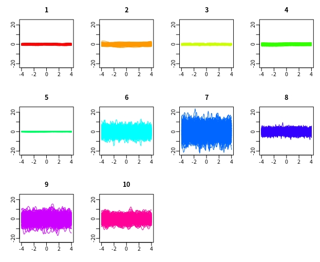

Large K=10

 函数型的模拟数据，零均值的模型，迭代50次

##  split-EM算法  SMGPFL.m

计算接受概率时，用带惩罚的对数似然:
BIC = -2*log L + (4)* k * log(Nm)

两种终止算法
  1. 每一次分裂重复100次，如果接受概率均小于1e-5,则终止
  2. BIC开始变大，则分裂被拒绝，否则，这次分裂被接受

然而，当重复次数足够多接受概率都非常小时，说明继续分裂的可能性已经非常小了，因而也不太可能计算出这之后分裂出的新参数的BIC。实际上，实验结果验证了这一点，BIC一直在减小，我们无法验证这之后的BIC是否还在减小，但可以猜想，这之后的BIC会增大。

## 每一类是100条，迭代50次的结果

- 模拟数据

<!--  -->

- 参数估计的精度（%）

428.699998821937	29.0919263020465	0.763560037412241
168.171710263479	17.0684436661605	1.66140501498165
450.375887141513	29.7389152884209	16.5786103989236
308.082030619231	59.5160455248081	0.456814110547314
924.956096892684	38.2766521697254	11.4616483101159
48.2753643319050	14.2246805577134	15.8175973450724
18.0566534946410	5.71565316282826	1.76866438291847
378.526865898346	95.6266950381174	52.5834897007328
106.463270452429	19.7072314102537	5.50973333821299
73.2092141837559	9.60324543082704	9.30491506759288

- 模型选择的错误率　94%
- 在模型选择正确的情况下，平均误分类率3.37%

- 预测的RMSE
 总体的平均RMSE   0.6833
