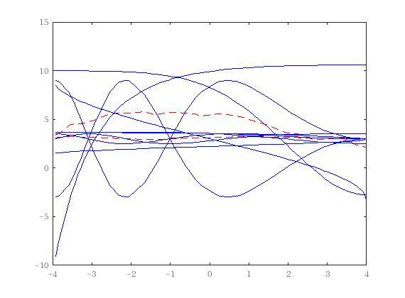
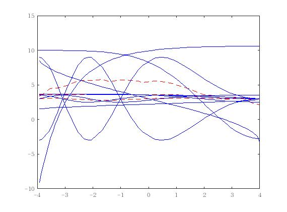
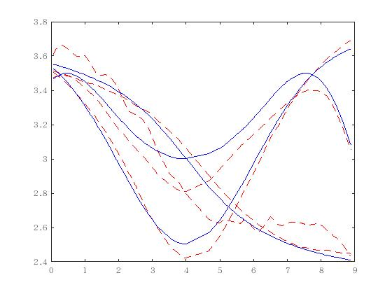
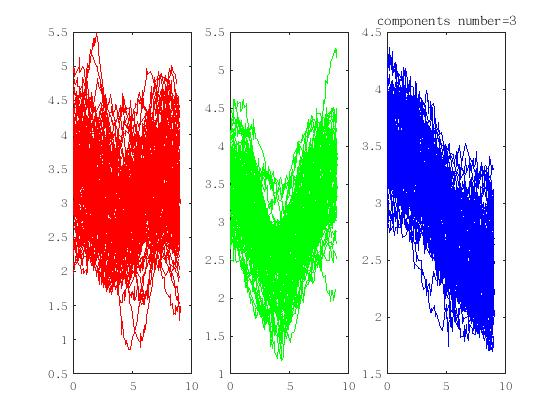

split-EM算法
- 时间 10s

- minimize.m和fminunc.m结果差不多，B-样条基函数用的吴迪编写的，结果如下

拟合的结果不如论文结果好

- 聚类结果

分类错误率是0.33%

- 参数
Theta =

    0.6275    0.9925    0.0631
    0.4512    0.7003    0.0636
    0.3267    0.4414    0.0634
和论文上结果差不多。
