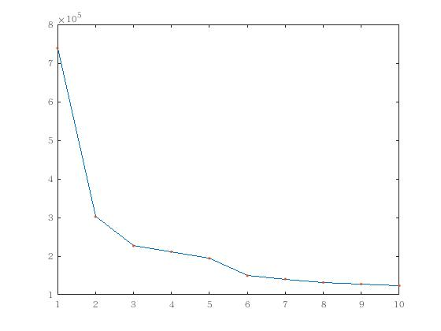
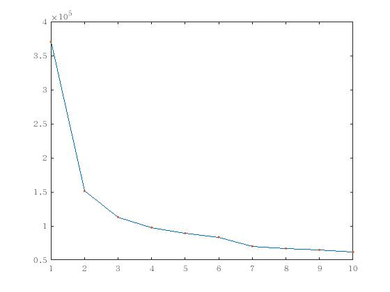
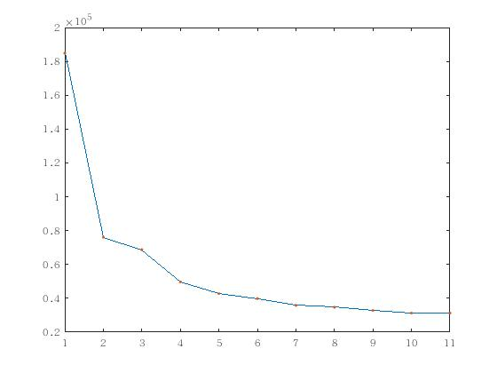
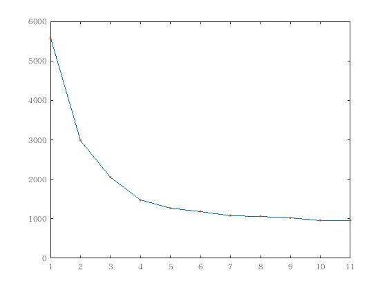

Large K

 零均值的模拟数据，零均值的模型

##  split-EM算法  SMGPFL.m

两种终止算法
  1. 每一次分裂重复100次，如果接受概率均小于1e-5,则终止
  2. BIC开始变大，则终止

然而，当重复次数足够多接受概率都非常小时，说明继续分裂的可能性已经非常小了，因而也不太可能计算出这之后分裂出的新参数的BIC。实际上，实验结果验证了这一点，BIC一直在减小，我们无法验证这之后的BIC是否还在减小，但可以猜想，这之后的BIC会增大。

- 预测结果
每一类的RMSE

 0.0565    0.0356    0.0498    0.0652    0.0240    1.2003    1.9578    1.6585    0.8028    0.1575

总体RMSE  0.6008　
实际上从第6类开始RMSE开始增大，这从模拟数据上可以看出，

高斯过程的参数取得较大，曲线变化剧烈.

##每一类是400条的结果
- 参数估计的精度

    0.4698    0.2890    1.4158
    1.0528    0.2860    0.0552
    0.5637    0.4695    1.3005
    0.4739    0.6512    0.4502
    5.4106    1.0869    0.9015
    1.4254    0.7219    1.2305
    0.4758    0.3685    0.0597
    0.2679    1.3547    0.8432
    0.4351    0.3189    0.3134
    0.2310    0.1557    1.3194

- 误分类率 0.0035

- 预测的RMSE
0.0567    0.0359    0.0505    0.0659    0.0243    1.1988    2.0283    1.6832    0.8062    0.1725

 总体RMSE 0.6122

- BIC

1.0e+05 *
7.3847    3.0214    2.2657    2.1111    1.9417    1.4924    1.4060    1.3175    1.2755    1.2345

  

  -  时间158min

##每一类是200条的结果
- 参数估计的精度
   2.3560    0.2629    1.2170
   1.9296    0.2276    0.0902
   2.0088    0.8203    0.6426
   2.5244    1.0703    0.6071
   1.9348    0.4570    1.2387
   0.3493    0.2582    2.5529
   0.9314    0.2542    0.8439
   1.7108    4.6543    2.0481
   1.5354    0.2218    0.4768
   0.1883    0.0827    1.9916

- 误分类率 0.0030

- 预测的RMSE
0.0559    0.0356    0.0510    0.0657    0.0242    1.1956    1.9231    1.6864    0.8046    0.1732

 总体RMSE 0.6015

- BIC

1.0e+05 *
  3.7012    1.5118    1.1306    0.9768    0.8928    0.8358    0.7027    0.6698    0.6490    0.6173

  

  -  时间125min
##每一类是100条的结果

- 参数估计的精度

    0.7813    1.5193    1.6237
    2.9806    1.3746    0.7639
    0.2064    0.4153    1.0280
    0.1479    1.7953    1.4102
    0.9397    0.0253    0.3557
    0.2114    0.3260    0.4148
    3.6269    1.0478    0.9091
    0.0515    2.3020    2.2761
    0.8162    0.0436    1.3152
    1.3093    0.4439    3.0238

- 误分类率0

- 预测的RMSE
0.0564    0.0360    0.0510    0.0662    0.0242    1.2190    1.9942    1.6885    0.8407    0.1611

 总体RMSE 0.6137

- BIC

1.0e+05 *

    1.8486    0.7611    0.6875    0.4968    0.4275    0.3985    0.3582    0.3471    0.3279    0.3126    0.3129

  
- time 55min
##每一类是10条的结果

- 参数估计的精度

　　0.2897    5.4079    0.2949
   17.5978    5.6192    0.0974
    7.1203    2.9364    0.0014
   16.3298    5.5667    0.9098
    9.3933    1.8108    3.8252
    1.4844    3.1787   15.4285
    3.8844    4.9465    5.5609
    0.4602    3.1269    1.9490
    9.1978    2.4651    4.4164
    6.5352    1.2247    8.2239

- 误分类率0

- 预测的RMSE
0.0589    0.0383    0.0507    0.0672    0.0246    1.0522    2.1229    1.5395    0.9727    0.1338

 总体RMSE 0.6061

- BIC

 1.0e+04 *
  1.8241    0.7561    0.5620    0.4890    0.4515    0.3868    0.3591    0.3472    0.3303    0.3226    0.3226    0.3258

  

 ## 每一类是3条的结果
 这时似然函数的差的相比于大样本情况来说较小，模型选择的准则必须被小心的选择以区分是否真的终止算法。
 这时选择AIC=-2loglik +参数个数(4k)

 - 参数估计的精度

   8.8494    1.0700    0.0234
    5.5259    3.7442    6.5795
    6.3203    1.4449   10.4713
   28.1911    6.1788    4.2752
    3.0282   10.1665    0.6537
    7.8439    1.7103    9.4715
    0.6818    1.6814    0.9179
   14.4846   46.2710   29.9463
    5.1219    3.4213    4.2394
    9.0227    2.4504    8.8762

 - 误分类率0

 - 预测的RMSE
 0.0566    0.0385    0.0717    0.0625    0.0257    1.1160    2.1265    1.7367    0.8180    0.0761

  总体RMSE 0.6128

 - BIC

 1.0e+03 *

     5.5684    2.9911    2.0532    1.4702    1.2669    1.1882    1.0838    1.0638    1.0207    0.9599    0.9603

   

- 每一类数目增加
每一类数目的增加可以提高参数估计的精度。
